# GitOps Configuration Management with ArgoCD

> This project demonstrates advanced configuration management in Kubernetes application deployments using **ArgoCD**, **Helm**, **Kustomize** and **external secret management** tools like **HashiCorp Vault** and **AWS Secrets Manager**.


```bash
my-argocd-project/
├── my-app/                    
│   ├── Chart.yaml             
│   ├── values.yaml            
│   └── templates/             
│       ├── deployment.yaml    
│       └── service.yaml      
├── my-app-kustomize/         
│   ├── base/                 
│   │   ├── deployment.yaml
│   │   ├── service.yaml
│   │   ├── myresource.yaml    
│   │   └── kustomization.yaml
│   └── overlays/
│       └── dev/               
│           ├── patch.yaml     
│           └── kustomization.yaml
├── helm-app.yaml              
├── kustomize-app.yaml         
├── myresource-crd.yaml        
└── argocd-cm.yaml
```

## Prerequisites

- Make sure you have the following installed:

- A computer with Git, kubectl, Helm, and ArgoCD CLI installed.
- A Kubernetes cluster (like Minikube or a cloud-based one).
- A Git repository (e.g., on GitHub) to store your files.
- ArgoCD installed on your Kubernetes cluster.


## Project Setup


## 1: Check Installed Tools
```bash
git --version
helm version
kubectl version --client
argocd version --client
```
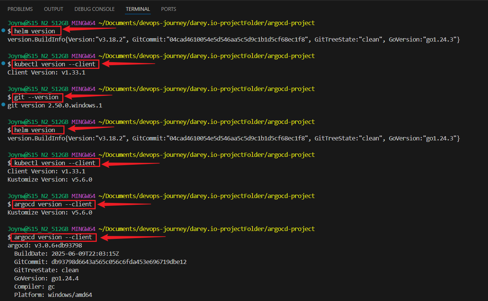


### Start Minikube and Check Kubernetes Cluster
```bash
minikube start
kubectl cluster-info
```


## Install ArgoCD in the cluster:

- Install ArgoCD in Kubernetes cluster and Verify:
```bash
kubectl create namespace argocd
kubectl apply -n argocd -f https://raw.githubusercontent.com/argoproj/argo-cd/stable/manifests/install.yaml
```


### Log in to ArgoCD:
```bash
kubectl -n argocd get secret argocd-initial-admin-secret -o jsonpath="{.data.password}" | base64 -d
argocd login localhost:8080 --username admin --password <paste-the-password>
```


- Forward the ArgoCD UI:
```bash
kubectl port-forward svc/argocd-server -n argocd 8080:443
kubectl port-forward svc/argocd-server -n argocd 8080:80
```

- Open `http://localhost:8080` on browser.
**Enter admin and the password when prompted.**


### Test:
```bash
kubectl get pods -n argocd
```
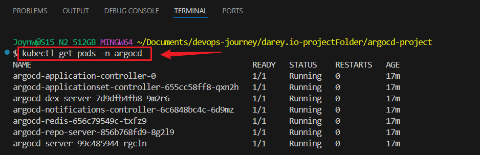


## Step 2: Create a Git Repository

##  Create a new folder for the Project:
```bash
mkdir argocd-project
cd argocd-project
git init
```


### Add and Push Folder to Github Repository 

```bash
git add .
git commit -m "initial commit"
git branch -M main
git remote add origin https://github.com/your-username/argocd-project.git
git push -u origin main
```


## Create a Helm Chart
```bash
helm create my-app
```

## Simplify the Helm chart

- Edit `my-app/Chart.yaml`
```bash
apiVersion: v2
   name: my-app
   description: A simple Helm chart for a toy app
   version: 0.1.0
```


- Edit `my-app/values.yaml`
```bash
replicaCount: 1

   image:
     repository: nginx
     tag: "latest"
     pullPolicy: IfNotPresent

   service:
     type: ClusterIP
     port: 80

   ingress:
     enabled: false
```


### Edit the service in `my-app/templates/deployment.yaml`

```bash
apiVersion: apps/v1
   kind: Deployment
   metadata:
     name: {{ .Release.Name }}
   spec:
     replicas: {{ .Values.replicaCount }}
     selector:
       matchLabels:
         app: {{ .Release.Name }}
     template:
       metadata:
         labels:
           app: {{ .Release.Name }}
       spec:
         containers:
         - name: my-app
           image: "{{ .Values.image.repository }}:{{ .Values.image.tag }}"
           imagePullPolicy: {{ .Values.image.pullPolicy }}
           ports:
           - containerPort: 80
```


### Edit the service in `my-app/templates/service.yaml`:

```bash
nano my-app/templates/service.yaml
```

### Paste:
```bash
apiVersion: v1
   kind: Service
   metadata:
     name: {{ .Release.Name }}
   spec:
     selector:
       app: {{ .Release.Name }}
     ports:
     - port: {{ .Values.service.port }}
       targetPort: 80
     type: {{ .Values.service.type }}
```


### Test Helm Chart Locally:
```bash
helm lint my-app
```


### Push the Helm chart to Git:

```bash
git add my-app
git commit -m "Add Helm chart for my-app"
git push
```

### Test:
- Run a Helm dry-run to check the chart:
```bash
helm template my-app ./my-app
```


## 3: Deploy the Helm Chart with ArgoCD

- Create an ArgoCD application for the Helm chart:
```bash
nano helm-app.yaml
```

```bash
apiVersion: argoproj.io/v1alpha1
   kind: Application
   metadata:
     name: my-app-helm
     namespace: argocd
   spec:
     project: default
     source:
       repoURL: https://github.com/your-username/my-gitops-project.git
       path: my-app
       targetRevision: main
     destination:
       server: https://kubernetes.default.svc
       namespace: default
     syncPolicy:
       automated:
         prune: true
         selfHeal: true
```

### Apply the application and Check ArgoCD::
```bash
kubectl apply -f helm-app.yaml
argocd app list
argocd app get my-app-helm
```
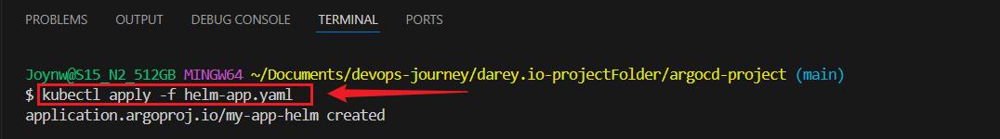
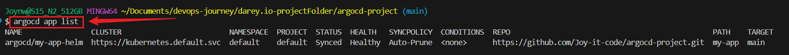


or visit `http://localhost:8080` on Browser

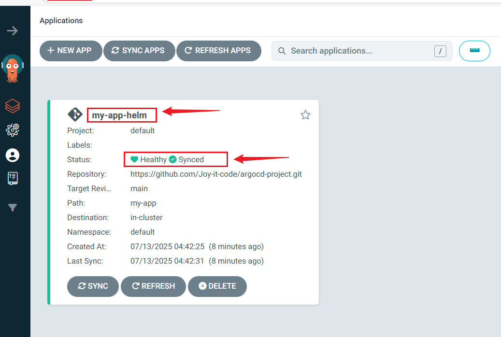
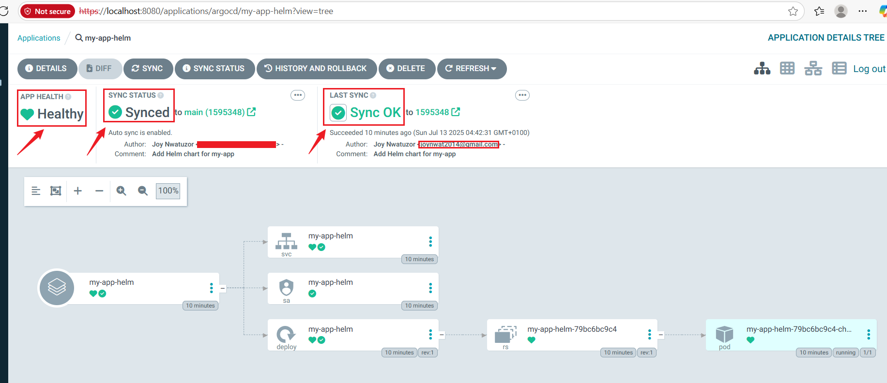


### Check the deployment and service:
```bash
kubectl get deployments
kubectl get services
```
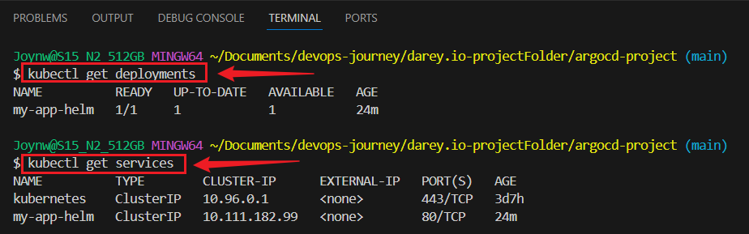


## 4: Create a Kustomize Configuration

- Create a Kustomize base:
```bash
mkdir -p my-app-kustomize/base
```


### Create `my-app-kustomize/base/deployment.yaml` file

#### Paste:
```bash
apiVersion: apps/v1
   kind: Deployment
   metadata:
     name: my-app
   spec:
     replicas: 1
     selector:
       matchLabels:
         app: my-app
     template:
       metadata:
         labels:
           app: my-app
       spec:
         containers:
         - name: my-app
           image: nginx:latest
           ports:
           - containerPort: 80
```


### Create `my-app-kustomize/base/service.yaml` File

#### Paste:
```bash
apiVersion: v1
   kind: Service
   metadata:
     name: my-app
   spec:
     selector:
       app: my-app
     ports:
     - port: 80
       targetPort: 80
     type: ClusterIP
```


### Create `my-app-kustomize/base/kustomization.yaml` File

#### Paste:
```bash
apiVersion: kustomize.config.k8s.io/v1beta1
   kind: Kustomization
   resources:
   - deployment.yaml
   - service.yaml
```


### Create a dev overlay:

```bash
mkdir -p my-app-kustomize/overlays/dev
```

### Create `my-app-kustomize/overlays/dev/patch.yaml` File


#### Paste:
```bash
apiVersion: apps/v1
kind: Deployment
metadata:
    name: my-app
    spec:
     replicas: 2
```

### Create `my-app-kustomize/overlays/dev/kustomization.yaml` File

#### Paste:
```bash
resources:
  - ../../base
patches:
  - path: patch.yaml
    target:
      kind: Deployment
      name: my-app
```


Push to Git:
```bash
git add my-app-kustomize
git commit -m "Add Kustomize configuration"
git push 
```

### Test dev overlay:
```bash
kubectl kustomize my-app-kustomize/overlays/dev
```


## 5: Deploy the Kustomize Configuration with ArgoCD

- Create an ArgoCD application for Kustomize:
```bash
touch kustomize-app.yaml
```

#### Paste:
```bash
apiVersion: argoproj.io/v1alpha1
   kind: Application
   metadata:
     name: my-app-kustomize
     namespace: argocd
   spec:
     project: default
     source:
       repoURL: https://github.com/your-username/argocd-project.git
       path: my-app-kustomize/overlays/dev
       targetRevision: main
     destination:
       server: https://kubernetes.default.svc
       namespace: default
     syncPolicy:
       automated:
         prune: true
         selfHeal: true
```         


### Test Locally:
```bash
kubectl kustomize my-app-kustomize/overlays/dev
```

### Apply the application:
```bash
kubectl apply -f kustomize-app.yaml
```


### Test:
```bash
kubectl apply -k my-app-kustomize/overlays/dev --dry-run=client
```


### Push Changes to Git
```bash
git add my-app-kustomize
git commit -m "Add missing kustomization.yaml to base and fix configuration"
git push
```


### Check ArgoCD
```bash
argocd app list
argocd app get my-app-kustomize
kubectl port-forward svc/argocd-server -n argocd 8080:443
```
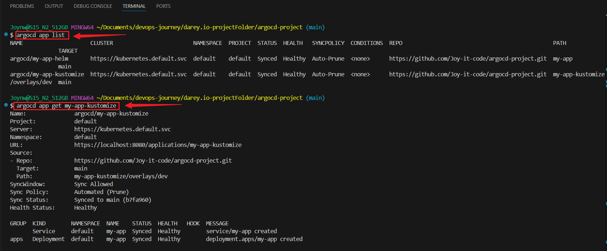
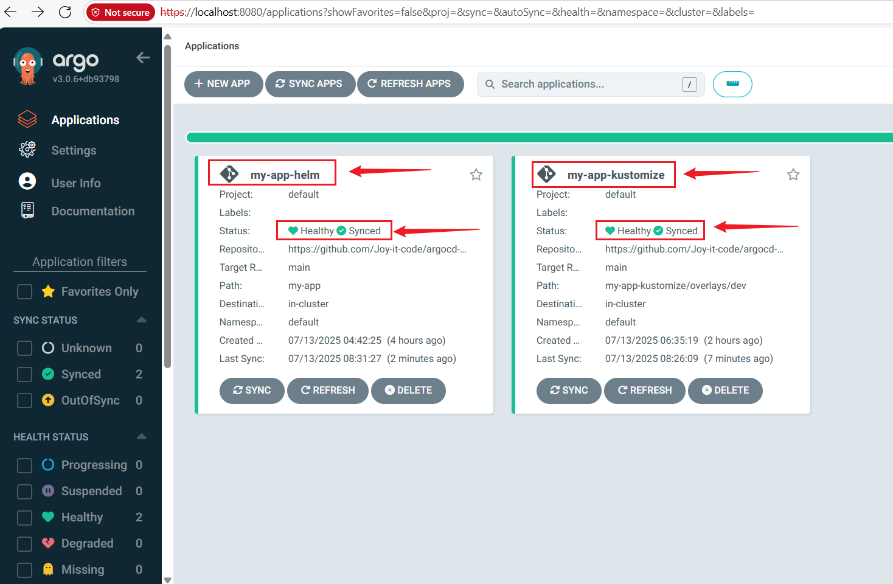
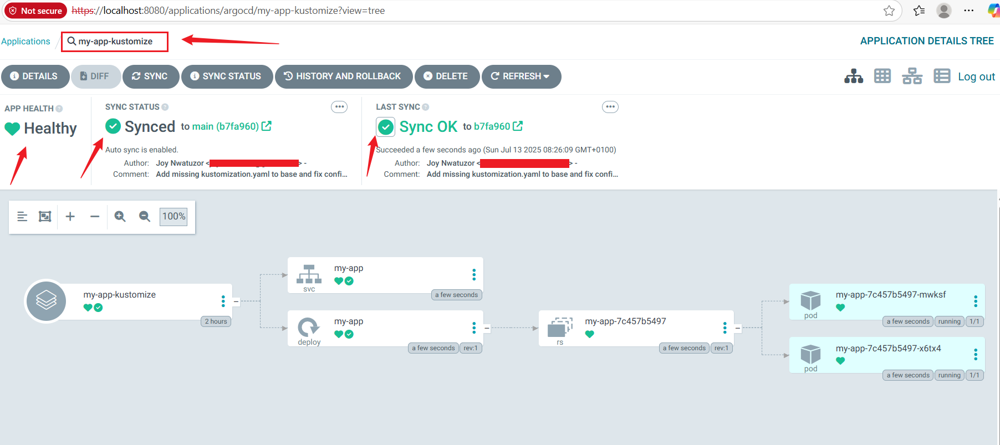


### Check the deployment in Kubernetes:
```bash
kubectl get deployments
kubectl get services
kubectl get pods
```
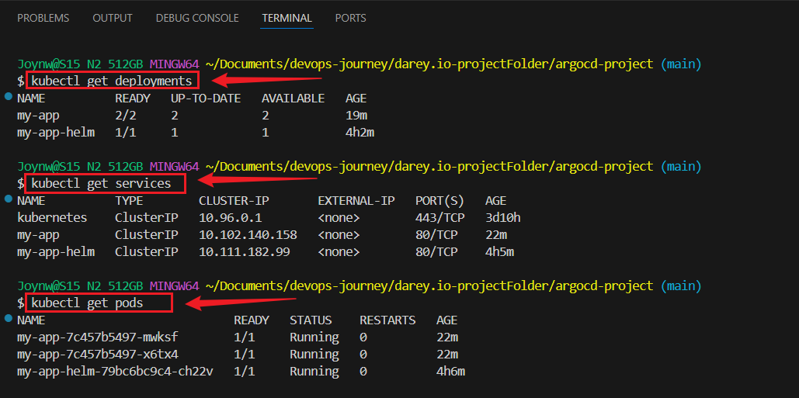


### 6: Secrets Management and Best Practices in ArgoCD

- Create a Kubernetes Secret:
```bash
kubectl create secret generic my-secret --from-literal=password=mypassword
```

### Update `my-app-kustomize/base/deployment.yaml`
#### Add:
```bash
           env:
           - name: MY_PASSWORD
             valueFrom:
               secretKeyRef:
                 name: my-secret
                 key: password
```

### Push Changes to Git:
```bash
git add my-app-kustomize/base/deployment.yaml
git commit -m "Add secret to Kustomize deployment"
git push
```

### Confirm Secret Usuage:
```bash
kubectl get secrets
argocd app sync my-app-kustomize
argocd app get my-app-kustomize
kubectl get pods
kubectl describe pod <my-app-pod-name>
```
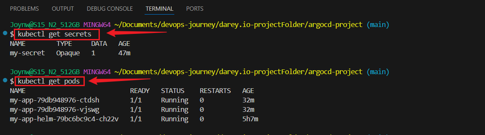
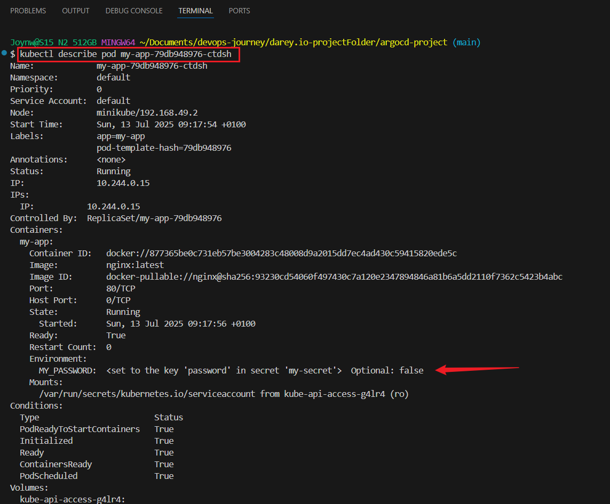
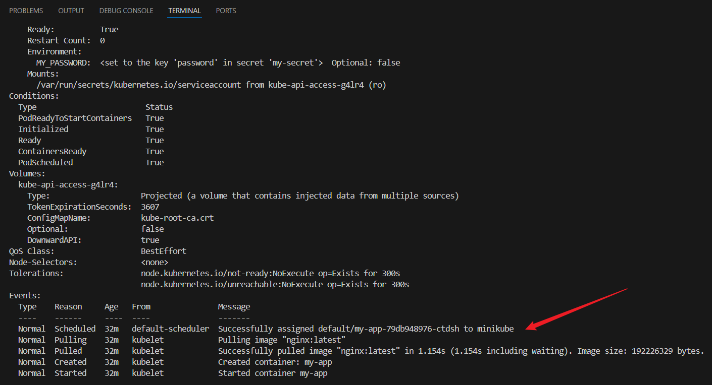


## 6: Integrate HashiCorp Vault
Pull the Correct Vault Image
```bash
docker pull hashicorp/vault:latest
docker images
```


- Set Up Vault:
```bash
docker run -d --name vault -p 8200:8200 -e 'VAULT_DEV_ROOT_TOKEN_ID=myroot' hashicorp/vault
docker ps
vault --version
export VAULT_ADDR='http://localhost:8200'
export VAULT_TOKEN='myroot'
echo $VAULT_ADDR
echo $VAULT_TOKEN
vault kv put secret/my-app password=mypassword
vault kv get secret/my-app
vault status
```
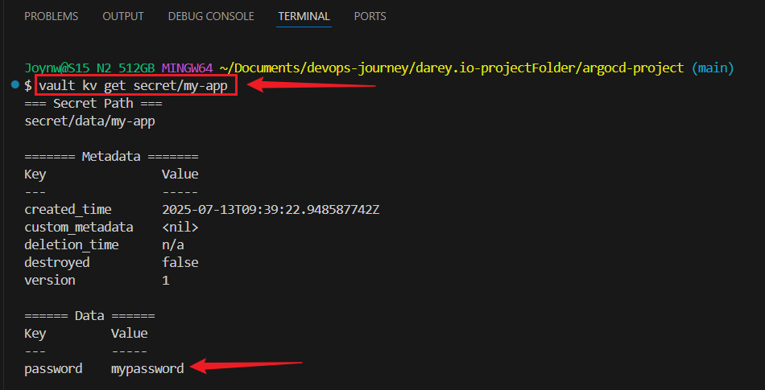


### Create and Apply Strategic Patch

- Create a strategic merge patch file (e.g., argocd-repo-server-patch.yaml):

```bash
cat <<EOF > argocd-repo-server-patch.yaml
spec:
  template:
    spec:
      initContainers:
      - name: download-tools
        image: alpine:3.8
        command: ["/bin/sh", "-c"]
        args:
        - >-
          wget -O argocd-vault-plugin https://github.com/argoproj-labs/argocd-vault-plugin/releases/download/v1.18.0/argocd-vault-plugin_1.18.0_linux_amd64 &&
          chmod +x argocd-vault-plugin &&
          mv argocd-vault-plugin /custom-tools/
        volumeMounts:
        - mountPath: /custom-tools
          name: custom-tools
      volumes:
      - name: custom-tools
        emptyDir: {}
      containers:
      - name: argocd-repo-server
        volumeMounts:
        - mountPath: /usr/local/bin/argocd-vault-plugin
          name: custom-tools
          subPath: argocd-vault-plugin
EOF
```

### Apply the strategic merge patch:
```bash
kubectl patch deployment argocd-repo-server -n argocd --patch "$(cat argocd-repo-server-patch.yaml)" --type=strategic
```
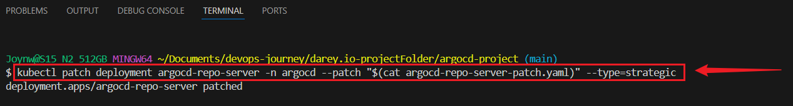


### Verify the Patch

```bash
kubectl get pods -n argocd
```
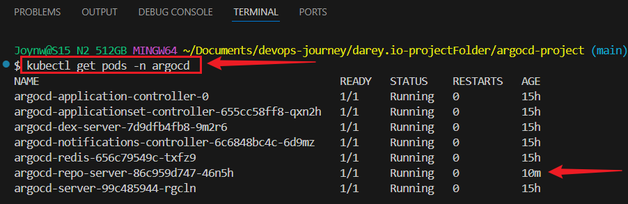


###  Update the Deployment for Vault 
- Modify `my-app-kustomize/base/deployment.yaml`
```bash
           env:
           - name: MY_PASSWORD
             value: <path:secret/my-app#password>
```


### Push the change to Git:
```bash
git add my-app-kustomize/base/deployment.yaml
git commit -m "Update deployment to use Vault secret with data path"
git push
```

### Update ArgoCD for Vault
- Modify `kustomize-app.yaml`
```bash
       targetRevision: main
       plugin:
         name: argocd-vault-plugin
         env:
         - name: VAULT_ADDR
           value: http://localhost:8200
         - name: VAULT_TOKEN
           value: myroot
     destination:
       server: https://kubernetes.default.svc
       namespace: default
     syncPolicy:
       automated:
         prune: true
         selfHeal: true
```


### Apply the change:
```bash
kubectl apply -f kustomize-app.yaml
```


### Sync the application:
```bash
argocd app sync my-app-kustomize
```


Verify:
```bash
argocd app get my-app-kustomize
kubectl describe pod my-app-79db948976-ctdsh
```