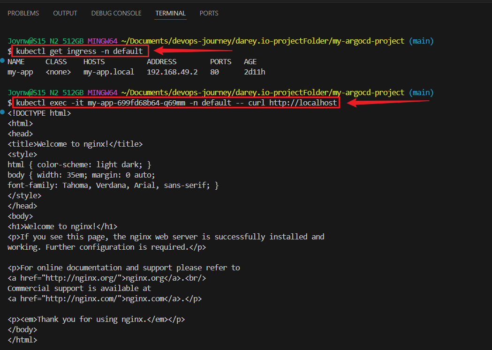

# GitOps Configuration Management with ArgoCD

> This project demonstrates advanced configuration management in Kubernetes application deployments using **ArgoCD**, **Helm**, **Kustomize** and **external secret management** tools like **HashiCorp Vault** and **AWS Secrets Manager**.


```bash
my-argocd-project/
├── helm/
│ └── my-app/ 
├── kustomize/
│ └── my-app/
│ ├── base/ 
│ └── overlays/
│ ├── dev/ 
│ └── prod/ 
└── secrets/ 
```

## Prerequisites

- Make sure you have the following installed:

- A computer with Git, kubectl, Helm, and ArgoCD CLI installed.
- A Kubernetes cluster (like Minikube or a cloud-based one).
- A Git repository (e.g., on GitHub) to store your files.
- ArgoCD installed on your Kubernetes cluster.


## Project Setup


## 1: Check Installed Tools
```bash
git --version
helm version
kubectl version --client
argocd version --client
```


### Start Minikube and Check Kubernetes Cluster
```bash
minikube start
kubectl cluster-info
```


## Install ArgoCD in the cluster:

- Install ArgoCD in Kubernetes cluster and Verify:
```bash
kubectl create namespace argocd
kubectl apply -n argocd -f https://raw.githubusercontent.com/argoproj/argo-cd/stable/manifests/install.yaml
```


### Log in to ArgoCD:
```bash
kubectl -n argocd get secret argocd-initial-admin-secret -o jsonpath="{.data.password}" | base64 -d
argocd login localhost:8080 --username admin --password <paste-the-password>
```


- Forward the ArgoCD UI:
```bash
kubectl port-forward svc/argocd-server -n argocd 8080:443
kubectl port-forward svc/argocd-server -n argocd 8080:80
```

- Open `http://localhost:8080` on browser.
**Enter admin and the password when prompted.**


### Test:
```bash
kubectl get pods -n argocd
```


## Step 2: Create a Git Repository

##  Create a new folder for the Project:
```bash
mkdir argocd-project
cd argocd-project
git init
```


### Add and Push Folder to Github Repository 

```bash
git add .
git commit -m "initial Helm chart commit for my-app"
git branch -M main
git remote add origin https://github.com/your-username/argocd-project.git
git push -u origin main
```


## Integrating Helm with ArgoCD

- Create a Helm chart:
```bash
helm create my-app
```

## Simplify the Helm chart

### Remove the ServiceAccount Template
```bash
rm my-app/templates/serviceaccount.yaml
rm my-app/templates/hpa.yaml
```


- Edit `values.yaml`
```bash
replicaCount: 1

image:
  repository: nginx
  tag: "latest"
  pullPolicy: IfNotPresent

service:
  type: ClusterIP
  port: 80

ingress:
  enabled: true
  hosts:
    - host: my-app.local
      paths:
        - path: /
          pathType: Prefix
          backend:
            service:
              name: my-app
              port:
                number: 8080
```


- Edit `deployment.yaml`
```bash
apiVersion: apps/v1
kind: Deployment
metadata:
  name: {{ include "my-app.fullname" . }}
  labels:
    {{- include "my-app.labels" . | nindent 4 }}
spec:
  replicas: {{ .Values.replicaCount }}
  selector:
    matchLabels:
      {{- include "my-app.selectorLabels" . | nindent 6 }}
  template:
    metadata:
      labels:
        {{- include "my-app.selectorLabels" . | nindent 8 }}
    spec:
      containers:
        - name: {{ .Chart.Name }}
          image: {{ .Values.image.repository }}:{{ .Values.image.tag | default "latest" }}
          imagePullPolicy: {{ .Values.image.pullPolicy }}
          ports:
            - name: http
              containerPort: 80
              protocol: TCP
```


### Update the service in my-app/templates/service.yaml:

```bash
nano my-app/templates/service.yaml
```

### Paste:
```bash
apiVersion: v1
kind: Service
metadata:
  name: {{ include "my-app.fullname" . }}
  labels:
    {{- include "my-app.labels" . | nindent 4 }}
spec:
  type: ClusterIP
  ports:
    - port: 8080
      targetPort: 80
      protocol: TCP
      name: http
  selector:
    {{- include "my-app.selectorLabels" . | nindent 6 }}
```


### Test Helm Chart Locally:
```bash
helm lint my-app
```


### argocd account list

## Create an ArgoCD Application for the Helm chart

- Create a file called helm-app.yaml:
```bash
nano helm-app.yaml
```

#### Paste:
```bash
apiVersion: argoproj.io/v1alpha1
kind: Application
metadata:
  name: my-app-helm
  namespace: argocd
spec:
  project: default
  source:
    repoURL: https://github.com/your-username/my-argocd-project.git
    path: my-app
    targetRevision: main
    helm:
      releaseName: my-app
      values: |
        replicaCount: 1
        image:
          repository: nginx
          tag: "latest"
        service:
          type: ClusterIP
          port: 80
        ingress:
          enabled: true
          hosts:
            - host: my-app.local
              paths:
                - path: /
                  pathType: Prefix
  destination:
    server: https://kubernetes.default.svc
    namespace: default
  syncPolicy:
    automated:
      prune: true
      selfHeal: true
```


## Push to GitHub
```bash
git add .
git commit -m "helm-app" 
git push
```


## Apply the Application to ArgoCD
```bash
kubectl apply -f helm-app.yaml
```

- Check the Application in ArgoCD
```bash
argocd app get my-app-helm
```

or visit the ArgoCD web interface `http://<ARGO_SERVER>`


## Check Pod and Application Status:
```bash
kubectl get pods -n default
kubectl describe pod <POD-NAME> -n default
```


## Check Minikube Tunnel, Ingress and Check Pod Acessibility:
```bash
minikube tunnel
kubectl get ingress -n default
kubectl exec -it my-app-699fd68b64-q69mm -n default -- curl http://localhost
```



